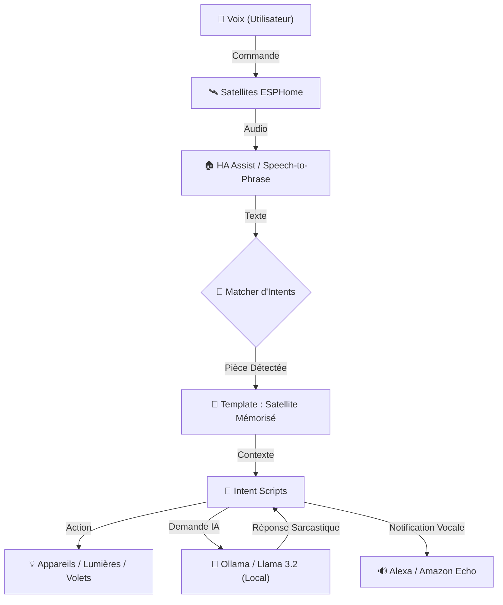

# 🤖 Assistant Vocal K-2SO : Hub Central

Qui n'a pas rêvé de commander sa maison à la voix, avec ses propres mots et expressions ? 
Baignant dans l'univers geek depuis toujours et fan inconditionnel de Star Trek, Star Wars, Stargate, Le Seigneur des Anneaux ou encore Doctor Who, mon but était simple : rendre ma maison aussi interactive que le pont de l'Enterprise ou la bibliothèque de Poudlard.

Pouvoir dire « Lumos » pour éclairer une pièce ou transformer son salon en « mode bunker » n'est plus de la science-fiction. À travers ces différentes phases, je vous invite à suivre mon aventure dans la création d'un assistant vocal vraiment personnel, intelligent et avec du caractère.

## 🏗️ Architecture du Système

Voici comment les données circulent entre votre voix et vos appareils :

> [!TIP]
> **Architecture Hybride** : Ce projet utilise une écoute 100% locale (ESP32) pour la fiabilité, mais peut utiliser le Cloud (Alexa) pour la sortie audio haute qualité. 
> [En savoir plus sur l'Architecture Vocale](./docs/architecture_vocale.md)

## 🗺️ La Route vers l'Automatisation Totale

### 📖 Concepts Fondamentaux
Avant de commencer, il est crucial de comprendre les piliers du projet :
- **[Conventions de Nommage](./docs/conventions_nommage.md)** : La règle d'or pour que le contexte fonctionne.
- **[Architecture Vocale](./docs/architecture_vocale.md)** : Pourquoi le local est roi.

---

| Phase | Nom | Focus | Fonctionnalité Clé |
| :--- | :--- | :--- | :--- |
| **Phase 1** | [Validation Technique](./phase_1/) | Fiabilité | Allumage direct et validation du flux. |
| **Phase 2** | [Modularité & Contexte](./phase_2/) | Pièces | Détection automatique de la pièce (Lumières & Volets). |
| **Phase 2.1** | [Intelligence Avancée](./phase_2.1/) | Scènes | Choix automatique des scènes (Jour/Nuit/Veilleuse). |
| **Phase 2.2** | [IA & Personnalité](./phase_2.2/) | **Caractère** | **Intégration Ollama & Humour K-2SO (100% Local).** |

---

### 🧪 [Phase 1 : Validation Technique Directe](./phase_1/)
**Objectif** : Valider le flux "Voix → Home Assistant" le plus vite possible.
- **Pourquoi la suivre ?** Pour être sûr que votre matériel est bien synchronisé.

### 🧭 [Phase 2 : Modularité & Contexte](./phase_2/)
**Objectif** : Rendre la maison consciente de votre position.
- **Pourquoi la suivre ?** Pour ne plus jamais avoir à nommer les pièces.

### 🧠 [Phase 2.1 : Intelligence d'Éclairage](./phase_2.1/)
**Objectif** : Gestion dynamique et scènes intelligentes.
- **Technique** : Intégration du script `gerer_eclairage`.

### 🤖 [Phase 2.2 : Personnalité K-2SO (IA Locale)](./phase_2.2/)
**Objectif** : Ajouter un caractère sarcastique à chaque interaction vocale.
- **Pourquoi la suivre ?** Pour transformer un simple robot en un assistant (péniblement) humain.
- **Technique** : Utilisation d'**Ollama** (Llama 3.2) hébergé dans un **conteneur Docker sur un NAS Open Media Vault (OMV)**.
- **Performance** : Utilisation du Passthrough GPU (GTX 1050 Ti) pour une confidentialité totale et un fonctionnement offline.

---

## 🛠️ Configuration Matérielle
Ce projet a été développé et testé avec les équipements suivants :
-  **Serveur Domotique** : Mini-PC (CPU Intel N150, 16 Go de RAM) sous Home Assistant OS.
-  **Serveur IA & Docker** : NAS sous **Open Media Vault (OMV)**.
-  **GPU IA** : NVIDIA GTX 1050 Ti 4GB (Passthrough Docker).
-  **Satellites de Zone** :
    - Salon : **ESP32-Box S3** (ESPHome).
    - Chambre : **ReSpeaker Kit** (ESPHome).
    - Autres : 2 x Atom Echo (ESPHome).
-  **Sortie Audio** : Amazon Echo (Studio D, Show Cuisine/Chambre, SdB).

---

## 💻 Pré-requis Logiciels
Pour faire fonctionner ce projet, vous avez besoin de :
- **[Home Assistant](https://www.home-assistant.io/)** (Core ou OS).
- **[Speech-to-Phrase](https://github.com/OHF-voice/speech-to-phrase)** : Moteur de reconnaissance locale (STT).
- **[ESPHome](https://esphome.io/)** : Gestion des satellites (ESP32-Box, Atom Echo, etc.).
- **[Alexa Media Player](https://github.com/alandtse/alexa_media_player)** : Intégration pour la sortie audio.
- **[Ollama](https://www.home-assistant.io/integrations/ollama)** (ou **[Gemini](https://www.home-assistant.io/integrations/gemini)**) : Moteur d'IA conversationnelle.
- **[Piper](https://github.com/OHF-Voice/piper1-gpl)** : Add-on TTS local (optionnel si usage Alexa).

---

## 🚀 Comment démarrer ?

1.  **Exploration** : Lisez le README de la [Phase 1](./phase_1/README.md).
2.  **Préparation** : Préparez vos propres `entity_id` (Cibles & Satellites).
3.  **Déploiement** : Suivez les instructions "Express" dans l'ordre (1 -> 2 -> 2.1 -> 2.2).

> [!CAUTION]
> **Adaptation obligatoire** : Vous DEVEZ remplacer les identifiants d'entités par les vôtres pour que le système soit opérationnel.

---
*Projet développé pour une immersion totale. La Phase 2.2 (IA K-2SO) est la dernière étape actuelle et fonctionne à 100% en local !* 🤖🚀
